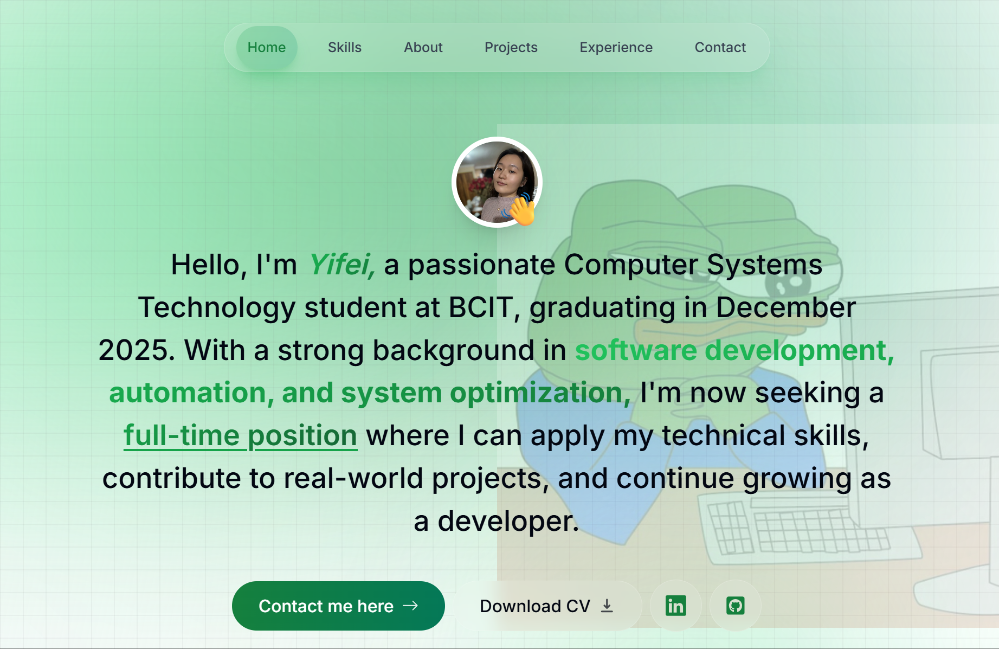

# Yifei Zeng's Portfolio

---

## About

Welcome to my portfolio! I'm Yifei, a passionate Computer System Technology student at BCIT. With a background in Ethnology and Digital Humanities, I offer a unique blend of cultural insight and technical acumen. I enjoy solving problems creatively and thrive as a team player. My hobbies include fitness, music, and travel.

## Projects

- **Don't Froget | 2-day Hackathon**
  - A website for habit tracking and mood recording.
  - **Technologies:** React, TypeScript, JavaScript, Tailwind, Spring (Java + REST API), MySQL.

- **Epic Adventure | Personal**
  - A Python text-based command line game with a graphical user interface.
  - **Technologies:** Python, Tkinter (GUI).

- **Suscipe | 24h Hackathon**
  - A mobile-first recipe generator website.
  - **Technologies:** JavaScript, CSS, Web API, JSON, Figma.

- **Cheapest Eggs | Academic**
  - A mobile-first grocery price search and sharing website.
  - **Technologies:** JavaScript, CSS, Bootstrap, jQuery, Firebase, Agile, Figma, Trello.

## Skills

- **Languages:** Python, JavaScript, Java, C, HTML, CSS, TypeScript.
- **Frameworks & Libraries:** React, Next.js, Node.js, Express.js, Tailwind, Bootstrap, jQuery.
- **Databases:** MongoDB, JSON, Firebase, SQL, RDBMS.
- **Tools & Practices:** Git, Agile/Scrum, SDLC, Testing, Microsoft 365.

## Experience

- **CST, Diploma | CGPA: 95%**
  - BCIT, Vancouver, BC.
  - Proficient in frontend (HTML, CSS, JavaScript), backend (Python, Java), and SQL.

- **Regional Operations Manager**
  - Xunjing Technology Ltd, Cairo, Egypt.
  - Analyzed user data, supervised team for technical support.

- **Digital Humanities, Master Of Science | With Merit**
  - University College London, London, UK.
  - Proficient in digital tools, web development (XML, PHP, JavaScript, HTML, CSS).

- **Ethnology, Bachelor Of Arts | GPA: 3.85**
  - Minzu University of China, Beijing, China.
  - Enhanced cross-cultural communication, critical thinking skills.

## Contact Me

Please feel free to contact me directly at [zengyifei327@gmail.com](mailto:zengyifei327@gmail.com) or through the contact form on my portfolio.

---

**© 2024 Yifei Zeng. All rights reserved.**

*About this website: built with React & Next.js (App Router & Server Actions), TypeScript, Tailwind CSS, Framer Motion, React Email & Resend, Vercel hosting.*
